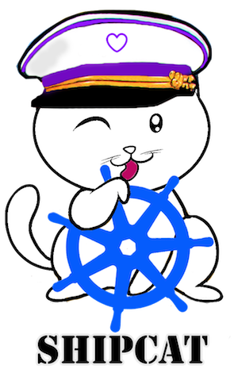

[](https://circleci.com/gh/Babylonpartners/shipcat)

[](https://quay.io/repository/babylonhealth/kubecat)


A small CLI helper to manage microservice deployments running on `kubernetes` via `shipcat.yml`. Lives [on your ship](https://en.wikipedia.org/wiki/Ship%27s_cat).

## Installation
To build yourself, use [rustup](https://rustup.rs/) to get latest stable rust.

```sh
rustup update stable # if build breaks on master
cargo build
ln -sf $PWD/target/debug/shipcat /usr/local/bin/shipcat
echo "source $PWD/shipcat.complete.sh" >> ~/.bash_completion
```

## Usage
In general, add keys to your `shipcat.yml` file in the [manifests repo](https://github.com/Babylonpartners/manifests) and make sure `shipcat validate` passes.

If you have `vault` credentials you can generate the complete kube file.

```sh
export VAULT_ADDR=...
export VAULT_TOKEN=...

shipcat validate babylbot
shipcat generate -r dev-uk babylbot
```


If you have `kubectl` credentials, you can ship your service and shell into pods:

```sh
kubectl auth can-i rollout Deployment
shipcat ship -r dev-uk babylbot

kubectl auth can-i create pods/exec
shipcat shell babylbot -p 1

kubectl auth can-i get,list pods/logs
shipcat logs babylbot -p 1
```

If you have `slack` credentials, you can use `shipcat slack` to talk to slack:

```sh
export SLACK_SHIPCAT_HOOK_URL=...
export SLACK_SHIPCAT_CHANNEL="#kubernetes"
shipcat slack hi slack
```
